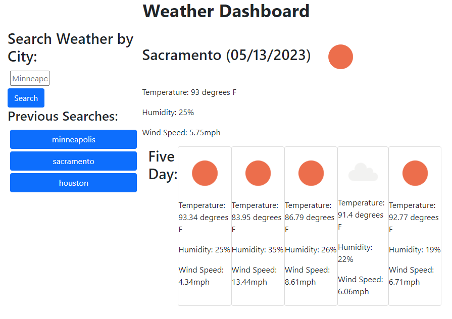

# Weather API
## About
In this project I created a weather dashboard web app using the Open Weather API. Users can search by city to display the current weather and five day forecast. Local storage is used to store previous searches for easy trip planning. 
## Screenshot

## Links
Open [https://potteramy.github.io/weather-api/](https://potteramy.github.io/weather-api/) with your browser to see the result.